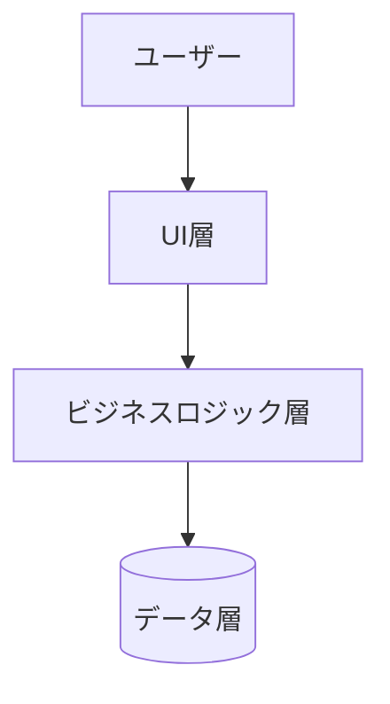
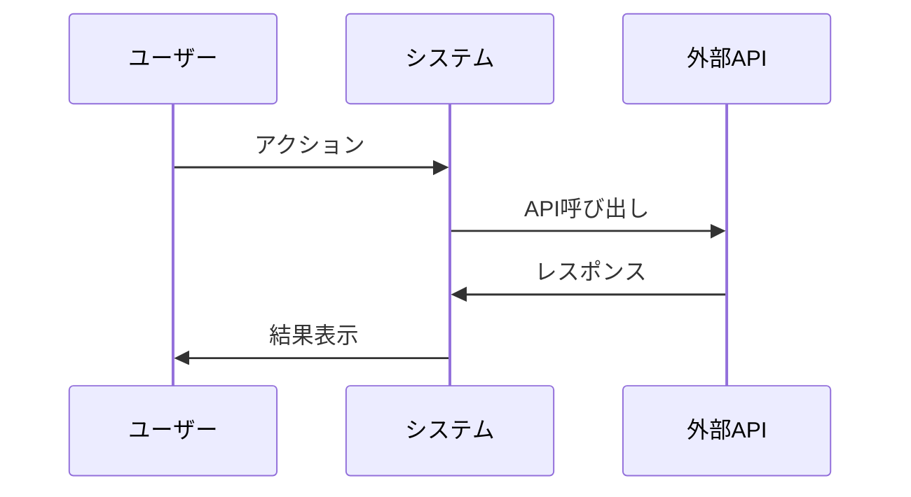

# 仕様駆動開発 (SPEC Mode Development)

## 📋 概要

SPEC Mode開発は、実装前に仕様を徹底的に検討し、人間とAIの協調によって設計完成度を最大化する開発手法です。どんなソフトウェアプロジェクトにも適用できる汎用的なアプローチを提供します。

**核心理念:**
- 🔍 仕様の徹底的な検討と反復改善
- 🤝 人間とAIの協調による品質向上
- 📋 構造化されたドキュメント駆動開発
- 🎯 実装前の設計完成度最大化

---

## 🏗️ 汎用プロジェクト構造

```
any-project/
├── .spec/                          # 仕様管理（言語・技術不問）
│   └── features/                   # 機能別仕様
│       └── [feature-name]/         # 任意の機能名
│           ├── requirements.md     # 要件定義（ユーザーストーリー）
│           ├── design.md          # 設計書（図表含む）
│           └── tasks.md           # 実装チェックリスト
├── docs/                          # プロジェクト文書
└── [source-code]/                 # 実装コード（任意の言語・FW）
```

---

## 🔄 SPEC Mode開発プロセス

### 💭 仕様検討フェーズ
**目的**: 仕様の完成度を実装前に最大化

1. **初期仕様案**: ユーザーストーリー + 基本受け入れ基準
2. **反復改善**: AI ⟷ 人間の対話による仕様洗練
3. **仕様承認**: 全要件確定、実装準備完了

### 🎯 実装フェーズ
**前提**: 仕様が完全確定済み

1. **Phase 1**: requirements.md（詳細要件）
2. **Phase 2**: design.md（設計・アーキテクチャ）
3. **Phase 3**: tasks.md（実装計画）

---

## 🤖 Claude用汎用プロンプト

### 🔍 仕様検討フェーズ用

```markdown
# Claude SPEC Mode: 仕様検討セッション

あなたは経験豊富なソフトウェアアーキテクトとして、私と協力して機能仕様を徹底的に検討します。

## 検討対象
- 機能名: [任意の機能名を入力]
- 概要: [機能の概要を入力]
- 技術領域: [Web/Mobile/Desktop/API/etc.]

## プロセス
1. **初期案提示**: ユーザーストーリー + 受け入れ基準
2. **課題洗い出し**: リスク・制約・エッジケース特定
3. **反復改善**: フィードバックベースの仕様改善
4. **完成度評価**: 実装準備度の判定

## 汎用検討観点
- 🎯 ユーザー価値・ビジネス価値
- 🔧 技術的実現可能性・制約
- 🛡️ セキュリティ・プライバシー
- ⚡ パフォーマンス・スケーラビリティ
- 🌍 アクセシビリティ・国際化
- 🔄 保守性・拡張性・テスト容易性
- ❗ エラーハンドリング・例外処理

## 出力テンプレート
### 📋 仕様案 v[N]
[ユーザーストーリー形式]

### ❓ 検討課題
1. [技術的課題・制約]
2. [ユーザビリティ課題]
3. [セキュリティ・パフォーマンス考慮点]

### 🔄 次のアクション
[具体的改善提案]

**原則**: 実装に入らず、仕様完成度100%を目指す
```

### 🎯 実装フェーズ用

```markdown
# Claude SPEC Mode: 実装フェーズ

確定済み仕様に基づいて構造化実装を実行してください。

## 前提
- 仕様検討完了、要件確定済み
- .spec/features/[feature-name]/ に仕様書存在

## 段階的実装手順
1. **要件詳細化**: requirements.md 最終化
2. **設計**: design.md 作成（図表・API設計）
3. **計画**: tasks.md 作成（実装チェックリスト）
4. **実装**: コード作成・テスト・検証
5. **文書化**: ドキュメント更新

## 汎用テンプレート

### requirements.md
```markdown
# [機能名] - 要件定義書 v1.0

## 概要
[機能の目的・背景・価値提案]

## 機能要件
### FR1: [要件名]
**ユーザーストーリー:** [役割]として、[目的]のために[機能]を使いたい。

#### 受け入れ基準
1. WHEN [条件] THEN [結果]
2. IF [条件] THEN [結果]
3. GIVEN [前提] WHEN [操作] THEN [期待結果]

## 非機能要件
- パフォーマンス: [具体的指標]
- セキュリティ: [要求事項]
- 可用性: [稼働率・復旧時間]
- 拡張性: [将来要件]
```

### design.md  
```markdown
# [機能名] - 設計書 v1.0

## アーキテクチャ
### システム構成
(Mermaid図表を挿入)
graph TB
    A[コンポーネント1] --> B[コンポーネント2]
    B --> C[コンポーネント3]

### データフロー
(Mermaid図表を挿入)
sequenceDiagram
    participant A as アクター
    participant B as システム
    A->>B: リクエスト
    B->>A: レスポンス

## 設計詳細
### コンポーネント1: [名称]
- **責任**: [単一責任]
- **API**: [インターフェース]
- **依存**: [外部依存関係]
```

### tasks.md
```markdown
# [機能名] - 実装チェックリスト v1.0

## 実装タスク
### 1. [フェーズ名]
- [X] 1.1 完了済みタスク (_要件:FR1_)
- [ ] 1.2 未完了タスク (_要件:FR2_)

## 完了基準
- [ ] 機能要件充足
- [ ] 非機能要件充足  
- [ ] テスト通過
- [ ] ドキュメント更新
- [ ] セキュリティ確認
```

**原則**: 段階的実装、継続的検証、文書連携維持
```

---

## 🔧 GitHub Copilot用汎用プロンプト

### 🔍 仕様検討フェーズ用

```javascript
// GitHub Copilot SPEC Mode: 仕様検討セッション
// 対象: [任意の機能名] ([言語/フレームワーク])
// 目的: 仕様完成度の最大化

/**
 * SPEC Mode 仕様検討プロセス
 * 1. ユーザーストーリー初期案
 * 2. 受け入れ基準詳細化
 * 3. 技術制約・リスク洗い出し
 * 4. 非機能要件検討
 * 5. 仕様反復改善
 */

// 汎用検討観点
// ✅ ユーザー価値・ビジネス価値
// ✅ 技術的実現可能性・制約
// ✅ セキュリティ・プライバシー要件
// ✅ パフォーマンス・スケーラビリティ
// ✅ アクセシビリティ・国際化
// ✅ 保守性・拡張性・テスト容易性
// ✅ エラーハンドリング・例外処理

/*
📋 現在の仕様案 v[N]
[ユーザーストーリー形式で記述]

❓ 検討課題
1. [技術的制約・課題]
2. [ユーザビリティ観点]  
3. [セキュリティ・パフォーマンス考慮点]

🔄 次のアクション
[具体的改善提案]
*/

// 原則: 実装に入らず、仕様完成を最優先
```

### 🎯 実装フェーズ用

```javascript
// GitHub Copilot SPEC Mode: 実装フェーズ
// 前提: 仕様確定済み、.spec/features/[feature-name]/存在
// 技術: [言語/フレームワーク名]

/**
 * SPEC Mode 実装手順
 * Phase 1: requirements.md 最終化
 * Phase 2: design.md 作成（アーキテクチャ図含む）
 * Phase 3: tasks.md 作成（チェックリスト）
 * Phase 4: 段階的コード実装
 * Phase 5: テスト・検証
 * Phase 6: ドキュメント統合
 */

// 汎用実装原則
// 📋 要件トレーサビリティ維持
// 🛡️ エラーハンドリング充実
// 📊 適切なログ・監視実装
// 💬 設計意図のコメント記述
// 🧪 テスタビリティ確保
// 🔄 リファクタリング容易性

interface SpecModeComponent {
  // 対応する要件ID
  requirementId: string;
  
  // コンポーネントの単一責任
  responsibility: string;
  
  // 外部依存関係
  dependencies: string[];
  
  // テスト戦略
  testStrategy: 'unit' | 'integration' | 'e2e';
}

// tasks.mdと連動した進捗管理
// [X] 完了済みタスク (requirementId: FR1)
// [ ] 実装中タスク (requirementId: FR2)
// [ ] 未開始タスク (requirementId: FR3)

// 品質保証チェックリスト
// [ ] 機能要件充足
// [ ] 非機能要件充足
// [ ] セキュリティ確認  
// [ ] パフォーマンス確認
// [ ] テスト通過
// [ ] ドキュメント更新
```

---

## 🎯 汎用記法規則

### 📝 ドキュメント記法（言語・技術非依存）

#### ユーザーストーリー形式
```
**ユーザーストーリー:** [役割]として、[目的]のために[機能]を使いたい。
```

#### 受け入れ基準形式（BDD準拠）
```
1. WHEN [条件] THEN [結果]
2. IF [条件] THEN [結果]  
3. GIVEN [前提条件] WHEN [アクション] THEN [期待結果]
```

#### タスク管理形式
```
- [X] 完了済み (_要件:FR1_)
- [ ] 未完了 (_要件:FR2_)  
- 🔄 進行中 (_要件:FR3_)
```

### 📊 視覚化（Mermaid活用）

#### システム構成図


#### 処理フロー図


---

## 🔍 汎用検討観点

### 🎯 ビジネス価値
- ユーザー価値・問題解決の明確化
- ビジネス目標・KPIとの整合性
- 投資対効果（ROI）の妥当性
- 市場競争力・差別化要因

### 🔧 技術実現性
- 既存アーキテクチャとの整合性
- 実装複雑性・技術的負債リスク
- パフォーマンス・スケーラビリティ要件
- セキュリティ・コンプライアンス要求

### 👥 ユーザビリティ
- ユーザー体験（UX）最適化
- アクセシビリティ・包摂性対応
- 多言語・多文化対応（i18n/l10n）
- デバイス・ブラウザ互換性

### 🚀 運用保守性
- モニタリング・ログ戦略
- デプロイメント・CI/CD統合
- 障害対応・復旧手順（SLA）
- 継続的保守・機能拡張計画

---

## ✅ 汎用チェックリスト

### 📋 仕様検討完了基準
- [ ] ユーザーストーリーが具体的・測定可能
- [ ] 受け入れ基準がテスト実行可能  
- [ ] エッジケース・例外処理網羅
- [ ] 非機能要件の定量的定義
- [ ] 関係者承認・合意形成完了
- [ ] 既存システム影響度評価完了

### 🎯 実装完了基準
- [ ] requirements.md 最終承認
- [ ] design.md 完成（図表・API仕様）
- [ ] tasks.md 完成（要件トレーサビリティ付き）
- [ ] 段階的実装・継続的テスト
- [ ] 全要件充足検証完了
- [ ] 技術文書・ユーザーガイド更新
- [ ] セキュリティ・パフォーマンス確認

---

## 💡 活用例

**SPEC Mode適用例**（技術非依存）:

### 🔍 仕様検討フェーズ
```
機能: ユーザー認証システム
技術: 任意（Web/Mobile/Desktop/API）

初期案 → 課題洗い出し → 反復改善 → 仕様確定
```

### 🎯 実装フェーズ  
```
確定仕様 → 設計詳細化 → タスク分割 → 実装・テスト → 検証
```

この汎用手法により、**あらゆる技術スタック・プロジェクト規模**で仕様駆動開発を実践できます。

---

**汎用SPEC Mode開発手法**  
**対応範囲**: 全技術領域・全プロジェクト規模  
**更新**: 2024-08-23 | **バージョン**: v2.0